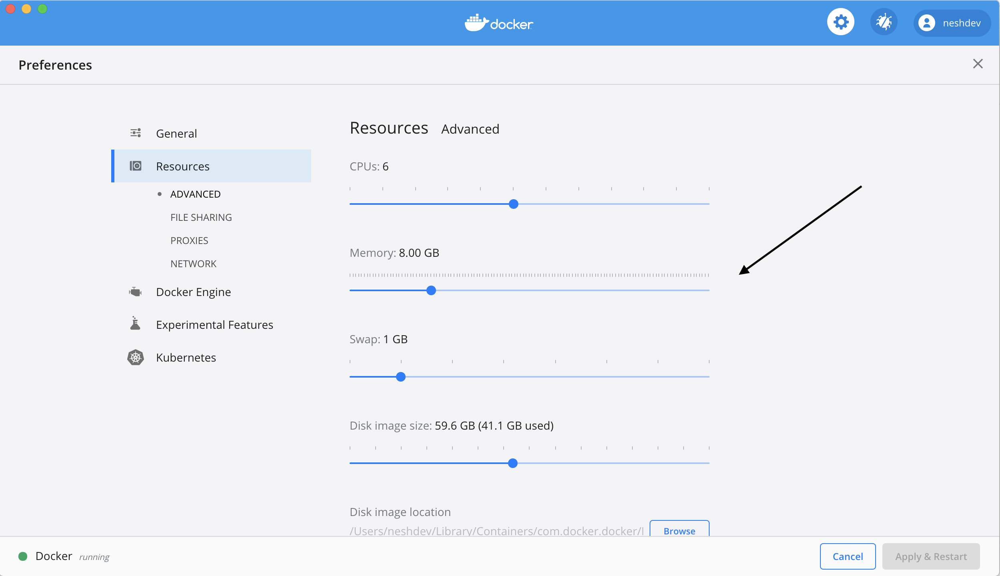

# Overview

TBD

# References
If you make use of this implementation, please cite the following paper:

Coregistration of Preoperative MRI with Ex Vivo Mesorectal Pathology Specimens to Spatially Map Post-treatment Changes in Rectal Cancer Onto In Vivo Imaging: Preliminary Findings
Jacob Antunes 1, Satish Viswanath 2, Justin T Brady 3, Benjamin Crawshaw 3, Pablo Ros 4, Scott Steele 5, Conor P Delaney 5, Raj Paspulati 4, Joseph Willis 6, Anant Madabhushi 2

## Prerequisites

The below software and configurations will be needed to execute the notebooks:

* Docker
    * Update docker with 8 gigs of memory
* git


# Getting started with Rad Path Fusion

## Running with docker

First clone this repository

```
git clone https://github.com/Theta-Tech-AI/radpathfusion.git
```

Second, we will quickly configure the docker memory

## Docker Setup:
1. Open Docker Destop
2. Open settings
2. Click on resources as seen on the below screen shot
4. Move the memory limit to 8 GB


Lastly, we will run the docker image using either:

1. docker-compose
2. docker run

### docker-compose

Run the following commands to start the docker container

```
cd docker
docker-compose up
```

### docker run

With this step, you don't need to clone the url.
Run the following commands to start the docker container

```
docker rm radxtools/radpathfusion-examples
docker pull radxtools/radpathfusion-examples
docker run -d -p 3000:3000 --name radpathfusion-examples radxtools/radpathfusion-examples
```

## Tutorials

Once the docker image is up and running. You can view our notebooks. You can get started with the notebook to learn how to use the package. You should start with `notebooks/Rad Path Fusion Final.ipynb`

The notebooks can be viewed by opening the browser and visting the url http://localhost:3000

A walk through of the notebook with screen shots can be found [here](/docs/notebook_starter.md)


# Contribution Guide:

Please follow google style formatting for [docstrings](https://google.github.io/styleguide/pyguide.html#38-comments-and-docstrings)

## Bugs and Feature Request

Please submit bugs and features to our github page.


## Pull Requests
Create a issue on our board.
Create a pull request with your changes. Tag your changes with the issue number (commit message should have issue number).
Someone from the team will review your request and merge your changes for the next release.
